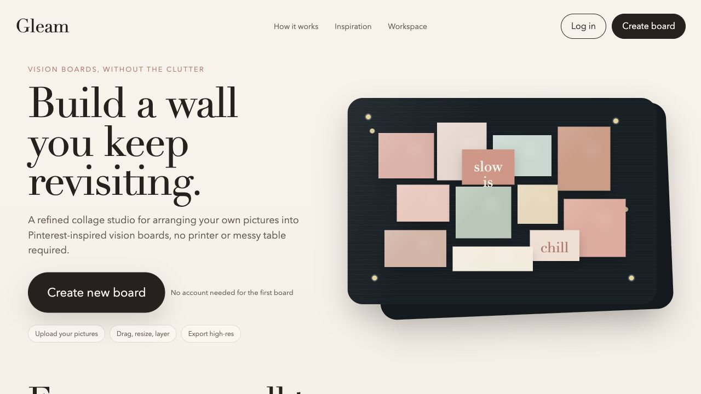
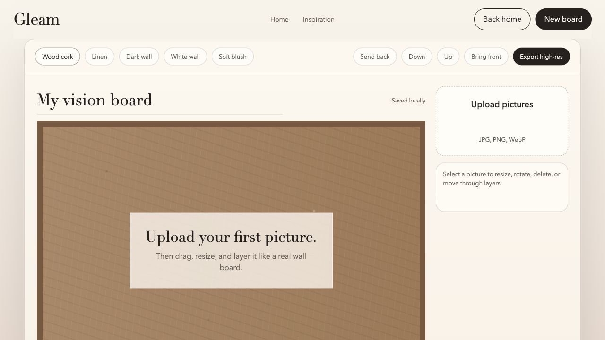

# Homepage + Workspace Split

Date: 2026-06-05

## Summary

Separated Gleam into a public homepage and a dedicated board workspace. The homepage now explains the product, shows inspiration, and sends users into a focused workspace when they create a board.

## Why This Iteration Happened

The previous version had the editor embedded directly on the homepage. That made Gleam feel more like a single tool surface than a product with a clear user flow.

This iteration makes the first experience clearer:

1. Land on Gleam.
2. Understand what the product does.
3. Click Create new board.
4. Enter the workspace.

## What Changed

- Created `workspace.html` for the actual board editor.
- Removed the embedded editor from `index.html`.
- Updated homepage navigation and CTAs to route users into the workspace.
- Added richer homepage content:
  - how Gleam works
  - workspace features
  - use cases
  - bottom CTA
- Rebalanced the homepage hero so the heading and board preview feel less oversized.
- Updated `app.js` so editor code only runs when workspace elements exist.

## User Experience Impact

Users now see Gleam as a product first, not just an editor. The homepage gives more context before asking users to create a board, while the workspace stays focused on making the board itself.

The new structure also makes future growth easier. Features like accounts, saved boards, templates, share links, and image storage can be introduced around the workspace without crowding the homepage.

## Screenshots

Homepage after the split:

Workspace after the split:

## Verification

- `npm run check` passed.
- `npm test` passed.
- Browser desktop check passed with no console errors.
- Confirmed the homepage no longer contains the embedded editor.
- Confirmed Create new board opens `workspace.html`.
- Confirmed New board resets the workspace to a blank board.

## Notes For Future Iterations

- Add real image assets or user-created example boards to make the homepage feel more concrete.
- Add account creation only when saved boards, cross-device sync, or shareable links are needed.
- Consider a simple board gallery or template picker once users can create multiple boards.
